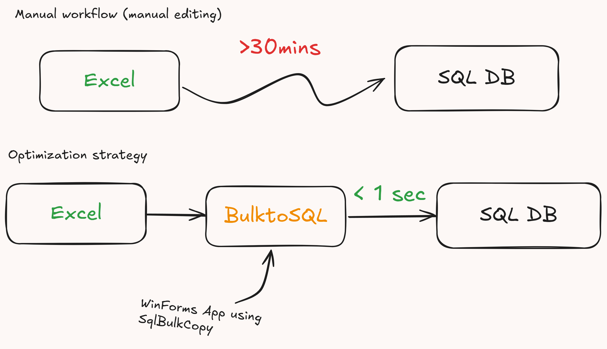

# BulkToSQL (C# WinForms)

A tool to **bulk insert Excel data into SQL Server in under 1 second**, replacing an existing manual SSMS workflow.

### Key Impact
- Reduced data import time from **~50 mins to <1 sec** using `SqlBulkCopy`.
- Enabled scalable ingestion of banking machine log data across multiple branches.
- Replaced existing manual process.

### Visual Summary

### Form Logic (extra)
]

> Real-world project built to solve a scaling data ops problem.